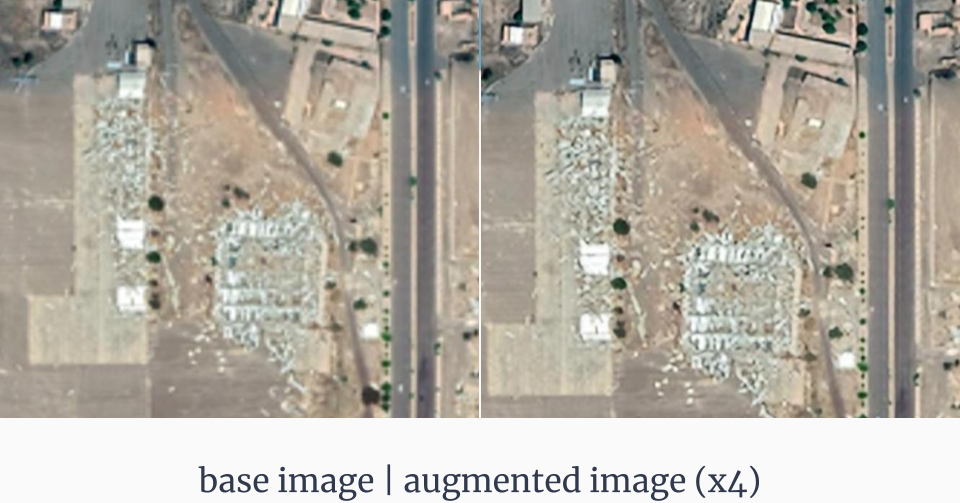
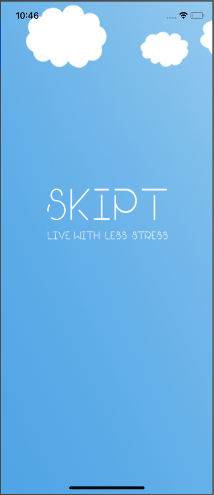
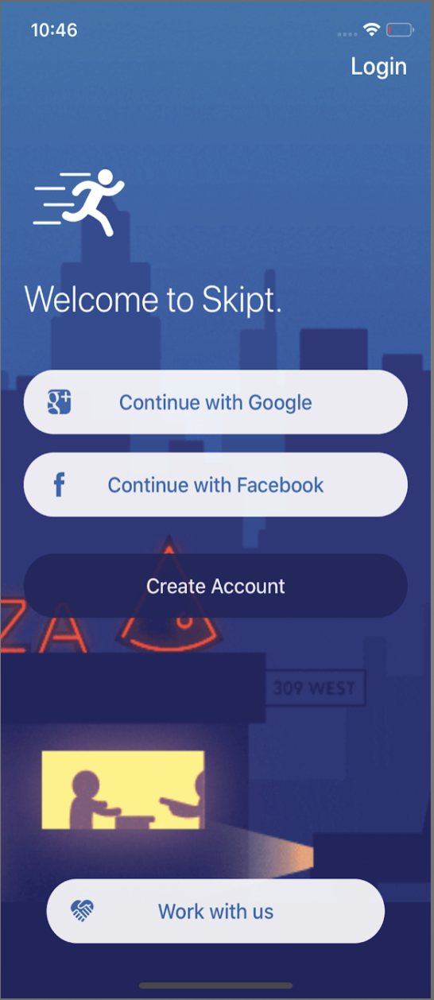
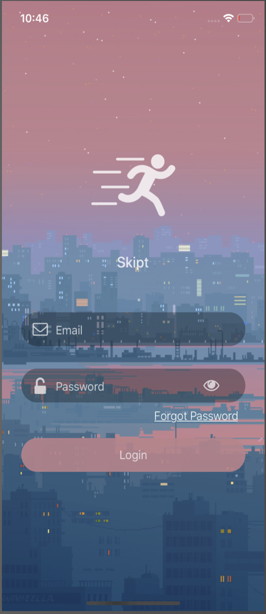
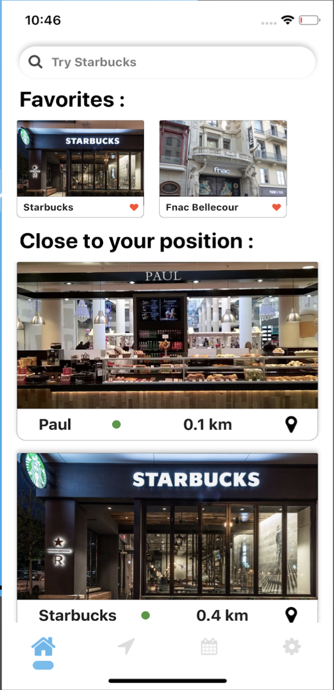
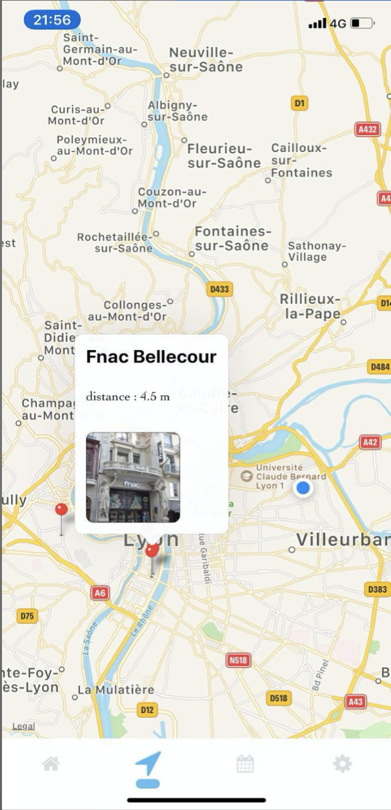
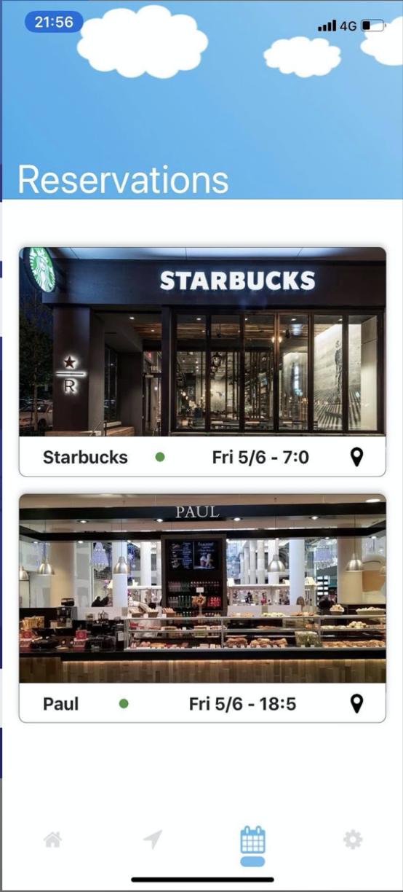

## Hi there 

<!--
## Projects

### Tracking the state of covid-19 using Twitter

### Bombsite detection in Yemen

 

 
 

### Skipt - Cross platform application (iOS/Android)

| Splash | Welcome | Log in | Home | Map | Reservations |
| ------ | ------- | ------ | ------ | ------ | ------ |
| 

 | 

 | 

 | 

 | 

 |

 |

-->

You can find me on [![LinkedIn][1.2]][1].

<!-- Icons -->
[1.2]: https://raw.githubusercontent.com/MartinHeinz/MartinHeinz/master/linkedin-3-16.png (LinkedIn icon without padding)

<!-- Links to your social media accounts -->

[1]: https://www.linkedin.com/in/bruno-sader/

<!-- 

**BrunoSader/BrunoSader** is a ✨ _special_ ✨ repository because its `README.md` (this file) appears on your GitHub profile.

Here are some ideas to get you started:

- 🔭 I’m currently working on ...
- 🌱 I’m currently learning ...
- 👯 I’m looking to collaborate on ...
- 🤔 I’m looking for help with ...
- 💬 Ask me about ...
- 📫 How to reach me: ...
- 😄 Pronouns: ...
- ⚡ Fun fact: ...
-->
